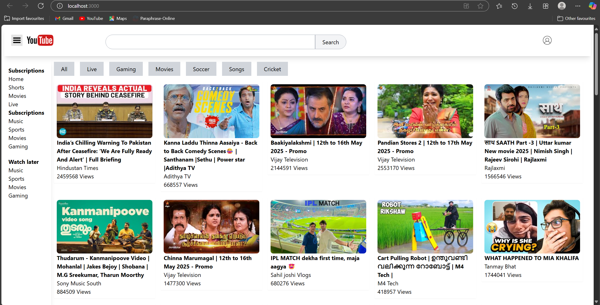
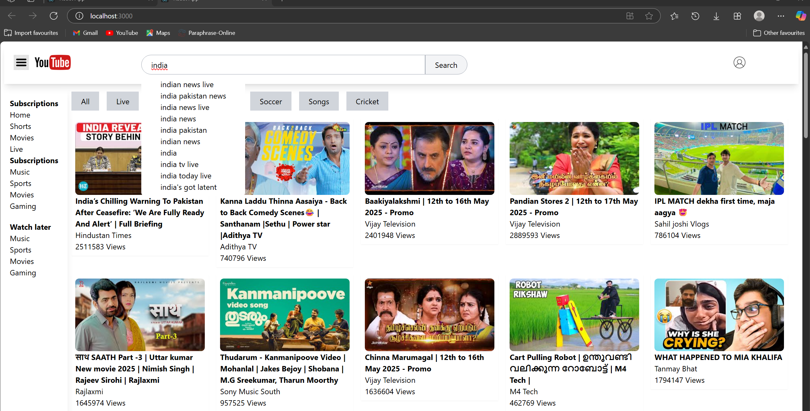
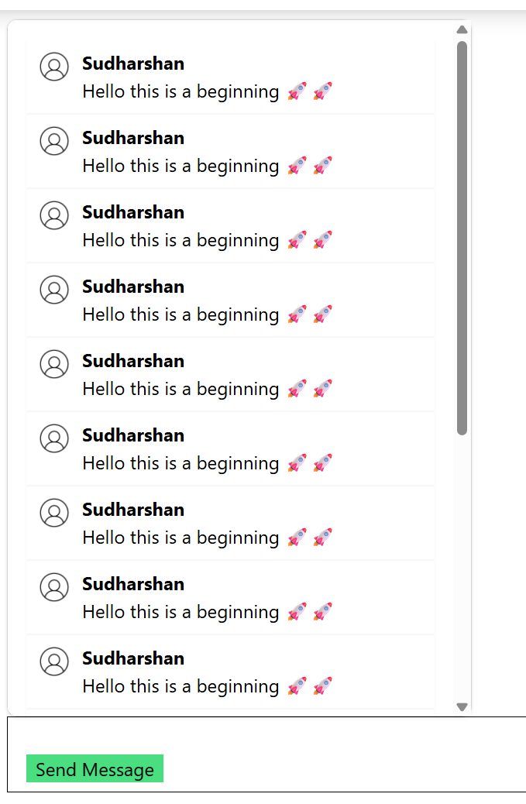

# 🎬 YouTube Clone (React + Tailwind CSS + Redux)

This project is a YouTube front-page clone built with **React**, styled using **Tailwind CSS**, state-managed by **Redux Toolkit**, and powered by the **YouTube Data API v3**.

---

## 🚀 Features

- 🔍 Live search suggestions (auto-complete)
- 📺 Real-time videos from YouTube API
- 📁 Reusable and modular components
- 💬 Live Chat simulation using Redux
- 🎨 Tailwind CSS for responsive design

---

## 📸 Screenshots

### 🏠 Home Page


### 🔍 Search with Suggestions


### 💬 Comments / Live Chat


---

## 🛠️ Tech Stack

- React
- Redux Toolkit
- Tailwind CSS
- React Router
- YouTube Data API

---

## 📦 Installation

```bash
git clone https://github.com/YOUR_USERNAME/YOUR_REPO_NAME.git
cd YOUR_REPO_NAME
npm install
